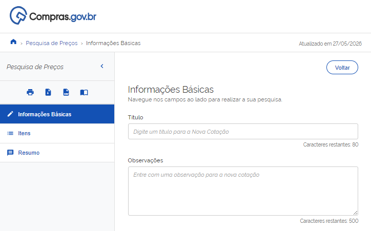

  Tamanho do texto:
  <button onclick="diminuirFonte()" title="Diminuir texto" style="padding: 6px 12px; font-weight: bold; cursor: pointer; border: 1px solid #ccc; border-radius: 4px; background: #f8f9fa;">A-</button>
  <button onclick="resetarFonte()" title="Tamanho normal" style="padding: 6px 12px; font-weight: bold; cursor: pointer; border: 1px solid #ccc; border-radius: 4px; background: #f8f9fa;">A</button>
  <button onclick="aumentarFonte()" title="Aumentar texto" style="padding: 6px 12px; font-weight: bold; cursor: pointer; border: 1px solid #ccc; border-radius: 4px; background: #f8f9fa;">A+</button>
  
  <button onclick="window.print()" style="background-color: #0056b3; color: white; padding: 6px 16px; border: none; border-radius: 5px; font-size: 14px; cursor: pointer; box-shadow: 0 2px 4px rgba(0,0,0,0.2); margin-left: 10px;">
    🖨️ Imprimir ou baixar esta página
  </button>

# 2. NOVA PESQUISA E ADIÇÃO DE ITENS

**Passo 07:** Preencha as informações básicas da consulta como título e observações e clique em “Itens”.

**Passo 08:** Na opção “Itens”, clique em “Adicionar Item” para incluir o material ou serviço que deseja pesquisar.

**Passo 09:** No campo de texto descreva de forma resumida o item que deseja pesquisar e selecione a opção mais adequada: Material ou Serviço.

!!! note "Nota"
    O sistema mostra as opções do catálogo do Compras.gov.br. Os itens que aparecem com a letra M antes do nome correspondem aos materiais e aqueles que aparecem com S são serviços. Ex: Você escreveu Computador. É um material. Na lista, vai aparecer: "M - Computador". Mas se você escreveu Manutenção de Computador, o que aparece é “S - Manutenção de Computador”, como mostra a tela abaixo.
    
    

**Passo 10:** No painel de consulta, selecione o item que melhor atende ao que deseja pesquisar, assim como a quantidade, a unidade de fornecimento e características necessárias para refinamento da pesquisa. Após identificar o item e preencher os campos de quantidade e unidade de fornecimento clique na opção “+” para incluir o item na lista de pesquisa.

 

  <button onclick="window.print()" style="background-color: #0056b3; color: white; padding: 10px 20px; border: none; border-radius: 5px; font-size: 16px; cursor: pointer; box-shadow: 0 2px 4px rgba(0,0,0,0.2);">
  🖨️ Imprimir ou baixar esta página
  </button>

