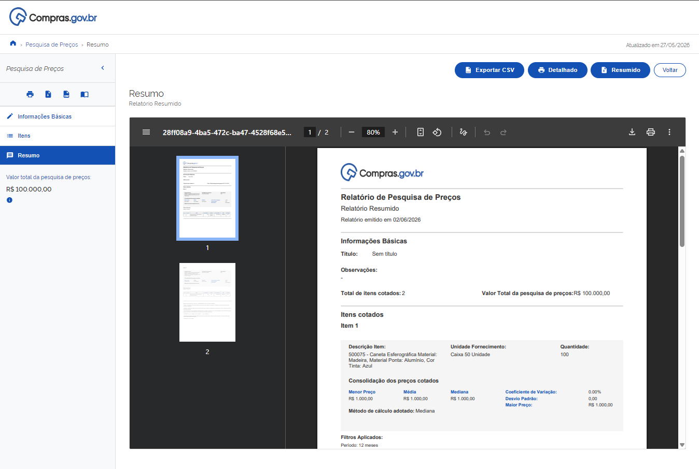
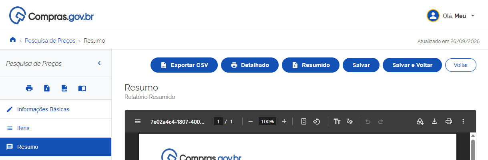

  Tamanho do texto:
  <button onclick="diminuirFonte()" title="Diminuir texto" style="padding: 6px 12px; font-weight: bold; cursor: pointer; border: 1px solid #ccc; border-radius: 4px; background: #f8f9fa;">A-</button>
  <button onclick="resetarFonte()" title="Tamanho normal" style="padding: 6px 12px; font-weight: bold; cursor: pointer; border: 1px solid #ccc; border-radius: 4px; background: #f8f9fa;">A</button>
  <button onclick="aumentarFonte()" title="Aumentar texto" style="padding: 6px 12px; font-weight: bold; cursor: pointer; border: 1px solid #ccc; border-radius: 4px; background: #f8f9fa;">A+</button>
  
  <button onclick="window.print()" style="background-color: #0056b3; color: white; padding: 6px 16px; border: none; border-radius: 5px; font-size: 14px; cursor: pointer; box-shadow: 0 2px 4px rgba(0,0,0,0.2); margin-left: 10px;">
    🖨️️ Imprimir ou baixar esta página
  </button>

# 4. RESUMO E RELATÓRIOS

**Passo 15:** Após preencher os campos obrigatórios de identificação e escolher as cotações que farão parte da sua pesquisa, clique na aba "Resumo".

Na página de Resumo será possível realizar as seguintes ações:

*   **Baixar e salvar o Relatório resumido:** Para gerar o relatório resumido da pesquisa realizada em PDF, clique no botão "Resumido".
*   **Baixar e salvar o Relatório Detalhado:** O relatório apresentará a média e a mediana dos últimos 12 meses, calculadas a partir das compras homologadas de todos os itens da consulta, junto com os dados de cada item. Clique no botão "Detalhado" para gerar.

*   **Exportar os dados obtidos:** Caso prefira extrair os dados e salvá-los em formato editável no seu computador, clique em "Exportar CSV" no canto superior direito.
*   **Salvar a pesquisa na sua conta:** Para armazenar a consulta e acessá-la posteriormente, clique no botão "Salvar Pesquisa". Se você já realizou o login Gov.br no início, o sistema confirmará o salvamento imediatamente. Caso ainda não tenha feito login, abrirá a tela de autenticação do Gov.br para vincular a pesquisa ao seu perfil.

!!! warning "Atenção"
    Ao clicar no botão "Home" ou em "Voltar" sem estar autenticado via Gov.br ou sem salvar a pesquisa, o sistema encerrará a consulta e os dados não ficarão salvos. 
    
    Para garantir que o seu trabalho não seja perdido e possa ser recuperado a qualquer momento, utilize o botão "Salvar Pesquisa" com o login Gov.br antes de sair.
    
    

**Suporte:** Caso tenha dúvidas ou precise de suporte, a Central de Atendimento do Ministério da Gestão e da Inovação em Serviços Públicos (MGI) está disponível pelo Portal de Serviços ou pelo telefone 0800 978 9001, de segunda a sexta-feira, das 8h às 18h.

 

  <button onclick="window.print()" style="background-color: #0056b3; color: white; padding: 10px 20px; border: none; border-radius: 5px; font-size: 16px; cursor: pointer; box-shadow: 0 2px 4px rgba(0,0,0,0.2);">
  🖨️ Imprimir ou baixar esta página
  </button>

