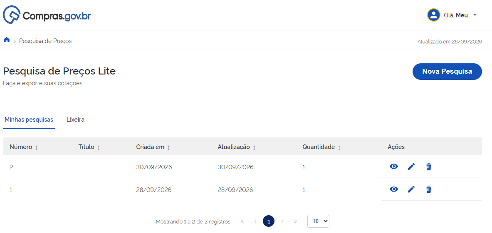
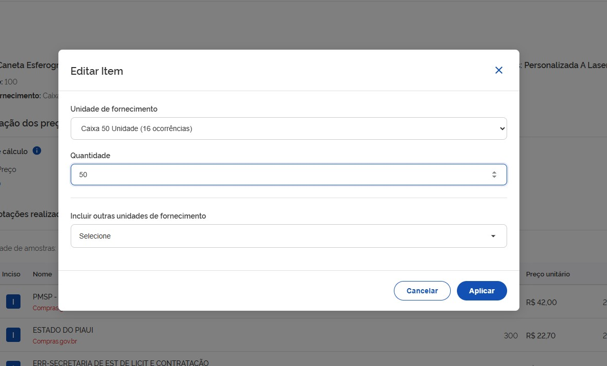

  Tamanho do texto:
  <button onclick="diminuirFonte()" title="Diminuir texto" style="padding: 6px 12px; font-weight: bold; cursor: pointer; border: 1px solid #ccc; border-radius: 4px; background: #f8f9fa;">A-</button>
  <button onclick="resetarFonte()" title="Tamanho normal" style="padding: 6px 12px; font-weight: bold; cursor: pointer; border: 1px solid #ccc; border-radius: 4px; background: #f8f9fa;">A</button>
  <button onclick="aumentarFonte()" title="Aumentar texto" style="padding: 6px 12px; font-weight: bold; cursor: pointer; border: 1px solid #ccc; border-radius: 4px; background: #f8f9fa;">A+</button>
  
  <button onclick="window.print()" style="background-color: #0056b3; color: white; padding: 6px 16px; border: none; border-radius: 5px; font-size: 14px; cursor: pointer; box-shadow: 0 2px 4px rgba(0,0,0,0.2); margin-left: 10px;">
    🖨️ Imprimir ou baixar esta página
  </button>

# 1. ACESSO E AUTENTICAÇÃO

**Passo 01:** Acesse o Portal de compras do governo federal: [https://www.compras.gov.br](https://www.compras.gov.br).

**Passo 02:** No canto superior esquerdo, localize o ícone com três linhas.

**Passo 03:** Ao clicar, será exibido um menu lateral. Nele, arraste o cursor até a opção “Sistemas”, depois “Compras.gov.br” e, em seguida, “Pesquisa de Preços”.

**Passo 04:** Na página do Pesquisa de Preços, clique no botão “Pesquisa de Preços Lite”.

**Passo 05:** Caso deseje recuperar pesquisas anteriores ou garantir que sua nova consulta fique salva, clique em "Entrar com GOV.BR" no canto superior direito e faça a autenticação com seu CPF e senha.

**Passo 06 (Recuperação):** Após o login, a página inicial exibirá a lista "Minhas Pesquisas". Para recuperar uma consulta salva anteriormente e continuar a edição ou emitir relatórios, localize a pesquisa desejada e clique no ícone de "Abrir/Visualizar" (ou no título da pesquisa).

!!! note "Nota"
    Caso deseje iniciar uma pesquisa do zero (com ou sem login), clique no botão "Nova Pesquisa" e siga para os passos seguintes.

 
# 2. NOVA PESQUISA E ADIÇÃO DE ITENS

**Passo 07:** Preencha as informações básicas da consulta como título e observações e clique em “Itens”.

**Passo 08:** Na opção “Itens”, clique em “Adicionar Item” para incluir o material ou serviço que deseja pesquisar.

**Passo 09:** No campo de texto descreva de forma resumida o item que deseja pesquisar e selecione a opção mais adequada: Material ou Serviço.

!!! note "Nota"
    O sistema mostra as opções do catálogo do Compras.gov.br. Os itens que aparecem com a letra M antes do nome correspondem aos materiais e aqueles que aparecem com S são serviços. Ex: Você escreveu Computador. É um material. Na lista, vai aparecer: "M - Computador". Mas se você escreveu Manutenção de Computador, o que aparece é “S - Manutenção de Computador”, como mostra a tela abaixo.
    
    

**Passo 10:** No painel de consulta, selecione o item que melhor atende ao que deseja pesquisar, assim como a quantidade, a unidade de fornecimento e características necessárias para refinamento da pesquisa. Após identificar o item e preencher os campos de quantidade e unidade de fornecimento clique na opção “+” para incluir o item na lista de pesquisa.

# 3. EDIÇÃO E GESTÃO DE COTAÇÕES

**Passo 11:** Caso deseje alterar a pesquisa, clique em “Editar item” (caneta) ou “Excluir Itens” (lixeira vermelha).

**Passo 12:** Após clicar em “Editar item” abrirá a tela de edição. No topo da página, o sistema exibe as informações oficiais do catálogo do sistema Compras.gov.br - CATMAT para materiais ou CATSER para serviços, a respeito do item selecionado:

*   **Descrição do Item:** Mostra o código (catmat ou catser) e a descrição padronizada (Ex: 500075 - Caneta Esferográfica Material: Madeira).
*   **Quantidade e Unidade de Fornecimento:** Indica a quantidade estipulada para a contratação e como o item é fornecido (Ex: Caixa 50 Unidade).

**Passo 13:** Faça as alterações necessárias e clique em “Aplicar”. O sistema confirma a atualização das unidades de fornecimento ou unidades, alertando que as cotações para aquele item serão atualizadas.

**Passo 14:** Confirme a alteração do item.

!!! tip "Dica"
    Pronto, a cotação para aquele item foi atualizada. Para atualizar os demais itens, basta seguir novamente as instruções dos Passos 11 e 12.

### Indicadores e Controle Estatístico

O Pesquisa de Preços Lite exibe os seguintes indicadores em tempo real:

*   **Métodos de Cálculo:** Permite visualizar e alternar o critério de obtenção do preço estimado entre Menor Preço, Média ou Mediana. O método selecionado influenciará diretamente no valor de referência calculado pelo sistema.
*   **Painel de Controle Estatístico:** Localizado à direita, apresenta o Coeficiente de variação, o Desvio padrão e o Maior preço encontrado na amostra, servindo de parâmetro para analisar a homogeneidade e a segurança dos dados.

O Pesquisa de Preços Lite também mostra a relação de contratações públicas que foram selecionadas para compor os preços.

Além disso, é possível detalhar as informações a respeito das compras. Ao expandir o registro, o usuário tem acesso completo às informações da compra, incluindo o número do processo, a modalidade de contratação (Ex: Dispensa), os dados do fornecedor, marca do produto e o critério de julgamento.

!!! warning "Atenção"
    É possível gerenciar as contratações que compõem a pesquisa de preços.
    
    *   Na coluna **Compor** é possível ativar ou desativar aquela cotação específica. Quando a opção estiver desativada, o valor é excluído dos cálculos estatísticos.
    *   Na coluna **Ações**, o ícone de lixeira exclui o registro da lista do item.

 
